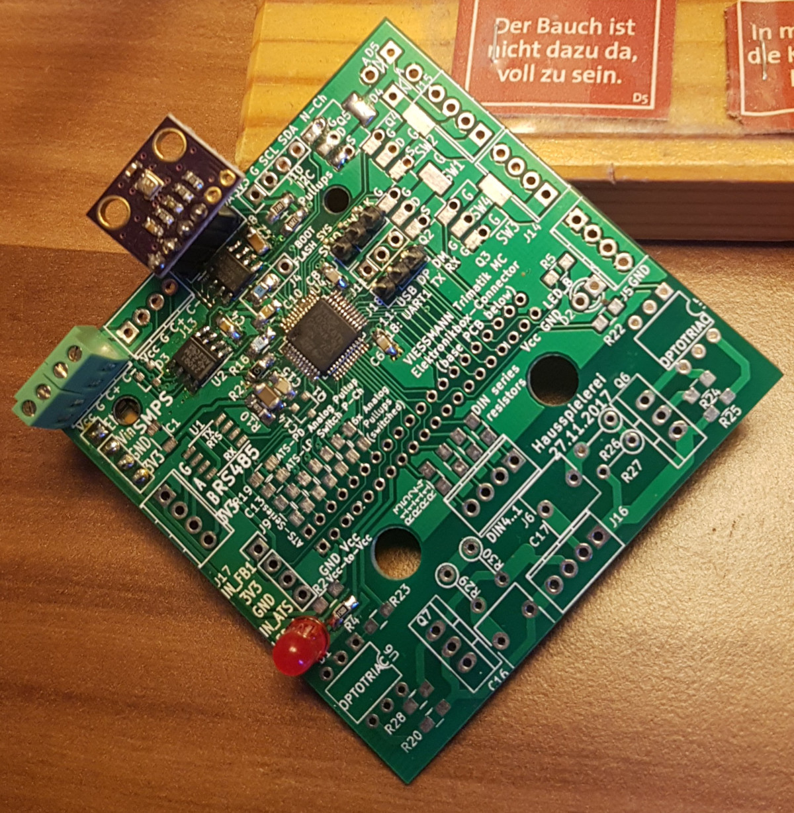
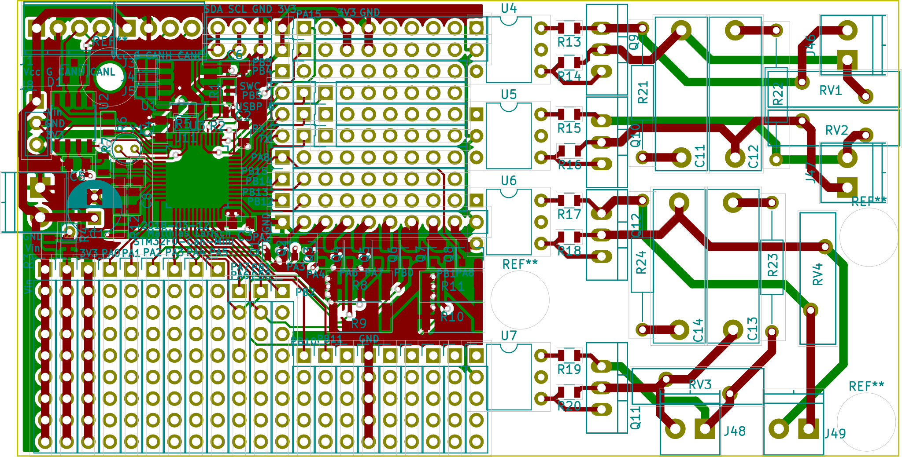
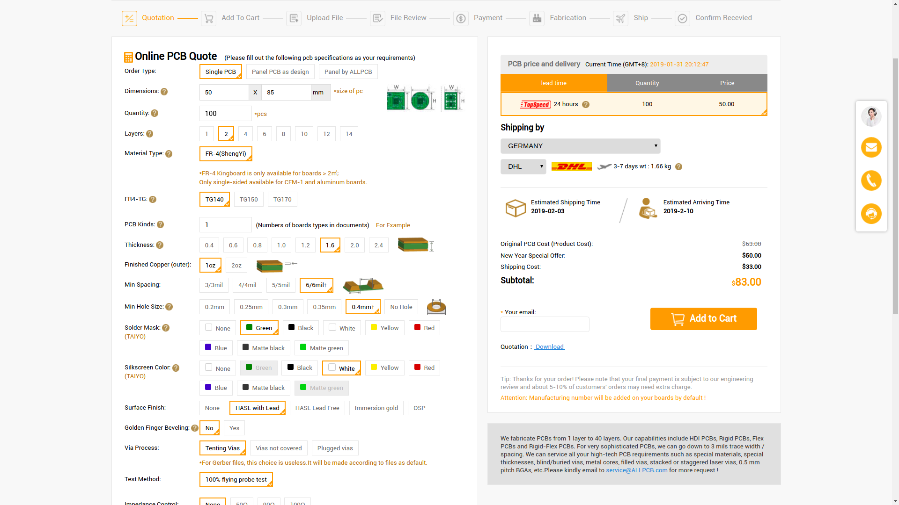
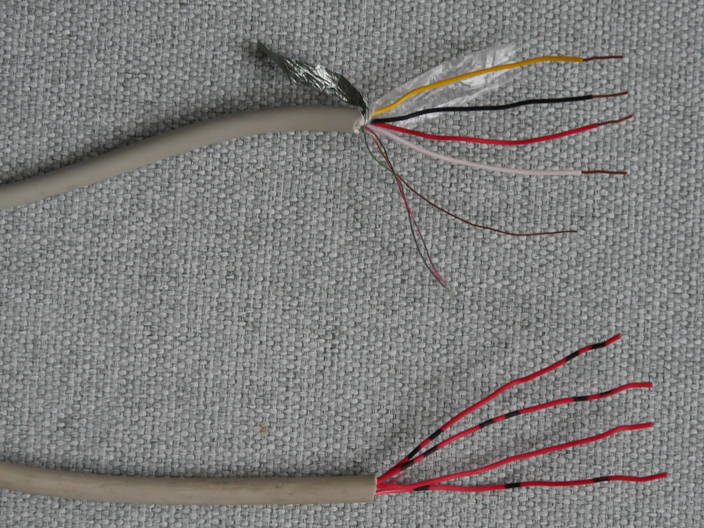
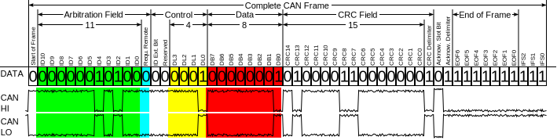
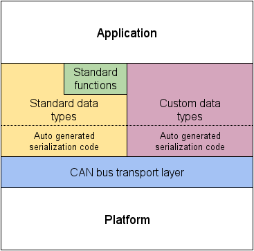

class: center
<h1 style="border-bottom: none; padding-top: 100px">HouseBus overview</h1>

.big[Nick Sellen, Matthias Larisch]


---

# home automation / smart home

* gathering data about the house
  * temperature, humidity
  * utilities data (water, gas, electricity)
  * door bell usage...
* controlling things around the house
  * lights, fans, door opening
* data awareness
  * showing people inside and outside the house how we live
* cool, fun learning project

---

# don't they already exist?


---
class: middle, center


---


---


---
# Hardware



* STM32 Microcontroller
  * 64 kByte program memory
  * 16 kByte RAM
  * 48 MHz
* CAN Transceiver
* 8 kByte EEPROM
* Connectors
  * Bus
  * Debug/Programming
  * Sensors
* Soldering area

---

---

---

---

# CAN-Bus


<small class="attribution">CC BY-SA Erkaha from wikimedia commons<br>CC BY-SA 3.0, https://commons.wikimedia.org/w/index.php?curid=31571749</small>

* Electrical transfer protocol: symmetrical, bidirectional transfer
* Arbitration, addressing, CRC



---

# UAVCAN



* builds on top of CAN:
  * addresses (127 nodes per network)
  * data types
  * broadcast messages
  * request / response messages


* Example type definition: 
```
uint3 brightness
bool door_open
bool person_inside
bool private_mode
bool fan_running
```
---

# Software

```C
/* some more stuff above */

void app_config_update(void)
{
  uint32_t t = config_get_uint(CONFIG_TEMPERATURE_RECEIVER_TARGET_NODE_ID);
  setReceiverTarget(t);
  wallTemperatureFactor = config_get_uint(CONFIG_WALL_TEMPERATURE_FACTOR_BY_1024);
  firstAlarmAfter = TIME_S2I(config_get_uint(CONFIG_HUMIDITY_ALARM_FIRST_AFTER_S));
  repeatAlarmEvery = TIME_S2I(config_get_uint(CONFIG_HUMIDITY_ALARM_REPEAT_INTERVAL_S));
}

void app_init(void)
{
  tone_init();
  bme280_app_init();
}

void app_fast_tick(void)
{
  melody_tick();
}

void app_tick(void)
{
  bme280_app_read();
  humidity_alarm_tick();
}
```


---

# Our applications

* influxdb writer
  * python app, sends data to influxdb, read by https://grafana.yunity.org
* internal web ui http://kanthaus-server
  * lets you control attic fan speed
* in progress
  * RFID tag door opener
  * solar battery charger data
* vaguely related
  * wifi and router data collection

---

# Ideas?

* automate fan speed based on humidity?
* open/close ventilation flaps based on humidity?
* doorbell announcer?
* thermostat controlled room heating controls?
* e-ink displays around the house to show useful information?

---
layout: false
class: big
# Join us!

* contribute! &rarr; [github.com/NerdyProjects/HouseBusNode](https://github.com/NerdyProjects/HouseBusNode) <small>(C, STM32)</small>
* contribute! &rarr; [github.com/yunity/uavcan-web](https://github.com/yunity/uavcan-web)
* contribute! &rarr; [github.com/yunity/uavcan-influxdb-writer](https://github.com/yunity/uavcan-influxdb-writer)
* uavcan &rarr; [uavcan.org](https://uavcan.org/)
* contribute! &rarr; [github.com/yunity/openwrt-stats-collector](https://github.com/yunity/openwrt-stats-collector)
* contribute! &rarr; [github.com/yunity/fritzinfluxdb](https://github.com/yunity/fritzinfluxdb)

